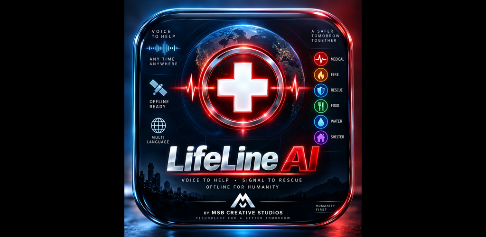

# LifeLine AI

**BY MSB CREATIVE STUDIOS**



LifeLine AI by MSB Creative Studios is an emergency triage application for voice and text distress reports. It classifies likely emergency type and severity, produces a locally generated SOS card, and lets the user review and share an alert package. LifeLine AI currently has no automatic government or rescue dispatch.

---

## Overview

LifeLine AI helps a user describe an emergency by speaking or typing, then returns a structured triage result. When the server is configured for online analysis, the Node/Express backend sends the transcript to the configured NVIDIA Nemotron model through Nebius Token Factory. When the key is missing or the user chooses Resilience mode, classification stays on local deterministic rules and does not call cloud AI.

The product is designed for explicit user control: microphone, GPS, camera, and sharing are activated by the user. Location is requested once for the active Silent SOS session. Up to two still images and an optional 10-second SOS video may be attached as evidence. Photo and video evidence are not sent to a vision AI model.

---

## Features

### Emergency voice and text triage

- Voice input uses the browser Web Speech API on the device; raw audio is not stored by LifeLine AI.
- Text or transcript is classified into emergency type, severity, needs, and a dispatch-style message.
- Results appear as an on-screen SOS card the user can copy, translate (when available), or share after confirmation.

### Online analysis (Nebius Token Factory / NVIDIA Nemotron)

When `NEBIUS_API_KEY` is set on the server, the backend calls the configured NVIDIA Nemotron model through Nebius Token Factory. The API key stays on the server and is not exposed to the browser.

### Offline / Resilience mode

When the user enables offline mode, or the API key is not configured, LifeLine AI uses local deterministic triage rules. No cloud AI request is made.

### Silent SOS

Silent SOS is a user-activated alert flow:

1. The user opens Silent SOS and selects an emergency type (optional message).
2. The app requests **current device GPS once** (`getCurrentPosition`). There is **no background GPS tracking** and **no `watchPosition`**. GPS is device geolocation, not inferred from video.
3. The user may capture or select **up to two images** as emergency evidence. There is **no continuous camera**.
4. The user may tap **CAPTURE SOS VIDEO** to record an optional **10-second** clip. Recording starts only after that tap and stops automatically at 10 seconds (or sooner if the user stops or cancels). Camera tracks are released immediately afterward.
5. Photo and video files are **evidence only**. They are **not** sent to a vision AI model and are **not** analyzed by Nemotron.
6. A review screen shows emergency type, severity, location or GPS-unavailable reason, timestamp, optional message, selected images, and video if present.
7. Sharing happens only after explicit confirmation (`navigator.share` with files when the browser supports file sharing, otherwise clipboard/text). If files cannot be attached, the UI states that photo/video attachments could not be included.
8. LifeLine AI **never automatically contacts** government or rescue services. Completing video capture does not share anything.

GPS errors are shown separately: permission denied, position unavailable, timeout, or geolocation unsupported.

Motion sensors, when present, are an optional session signal only. Sensor data is not proof of an emergency.

---

## Emergency Partner Integration Framework

LifeLine AI includes a country-aware Emergency Partner integration framework supporting three distinct provider types:

### Provider Types

1. **TEST / DEMO PROVIDER**
   - Labeled clearly: `"TEST EMERGENCY PARTNER — DEMONSTRATION ONLY"`.
   - Used exclusively for system demonstrations.
   - Simulates receiving an SOS package and returns a mock acknowledgment with a reference ID (`DEMO-ACK-XXXXX`).
   - Does NOT send alerts to any real government, police, fire, or rescue organization.

2. **PUBLIC CONTACT PROVIDER**
   - Displays officially published emergency contact numbers and websites (e.g., 911 in US, 112 in EU/India, 108 in India, 999 in UK, 000 in Australia).
   - Only populates contacts from verified official government sources.
   - Clearly states that no digital API exists for automated dispatch.
   - Does NOT automatically upload GPS, photos, or video to public telephone lines or websites unless explicitly supported by documented submission methods.

3. **AUTHORIZED API PROVIDER**
   - Used only when an organization has provided an actual, documented API interface.
   - Sends the structured SOS package over secure HTTPS to the authorized endpoint.
   - Credentials remain server-side and are never exposed in browser or client code.
   - Supports request validation, authentication, provider acknowledgment, error handling, and safe retries.

### Offline-First & Pending Transmission Queue

- **Offline SOS Generation**: Device GPS can be acquired offline if location hardware is available. Offline emergency classification, photo evidence (up to 2 images), and 10-second video recording continue to function without internet.
- **Local Storage**: When offline, an SOS package (containing SOS ID, timestamp, emergency type, severity, message, GPS coordinates/accuracy, photo/video evidence metadata, and source status) is saved locally only after explicit user review and confirmation.
- **Connectivity & Consent**: Cloud or API transmission cannot occur without an active communication path. Before any automatic transmission when connectivity returns, a privacy-preserving user setting ("Send pending SOS when connection returns") is provided.
- **Privacy Default**: Automatic transmission on connection return defaults to `OFF`. If enabled and the user explicitly approved partner transmission, the queue detects network connectivity, transmits to the authorized/test endpoint, prevents duplicate submissions, and marks the SOS as `SENT` only after receiving a valid provider acknowledgment.
- **Media Upload Limits**: Photos and video are only transmitted to a real provider if its documented API interface explicitly supports media uploads.
- **User Review & Control**: Mandatory explicit consent modal is shown prior to any transmission. Users can view, manually transmit, or delete any unsent pending SOS from the queue at any time.

---

## Emergency Organization Integration

LifeLine AI provides an integration framework for authorized emergency,
rescue, public-safety, and government organizations.

The framework supports TEST / DEMO, PUBLIC_CONTACT, and AUTHORIZED_API
provider types.

Organizations must provide and authorize their own API contract,
authentication method, payload requirements, media rules, sandbox endpoint,
and acknowledgment format before a real integration is enabled.

See:
[Emergency Organization Integration Guide](EMERGENCY_ORGANIZATION_INTEGRATION.md)

---

## Architecture

```
Browser  →  Node/Express backend  →  NVIDIA Nemotron (Nebius Token Factory)
                 │
                 ├─ Emergency Partner API Endpoint (/api/emergency-partner/dispatch)
                 │     ├─ TEST Provider (Mock Acknowledgment & Reference ID)
                 │     ├─ AUTHORIZED API Provider (Server-Side HTTPS Authentication)
                 │     └─ PUBLIC CONTACT Provider (Direct Phone/Website Info Only)
                 │
                 ├─ Privacy Contact Form Endpoint (/api/privacy-contact)
                 │     └─ Server-side SMTP relay → PRIVACY_CONTACT_EMAIL (env var only)
                 │
                 └─ Offline / Resilience mode: local deterministic rules (no cloud AI)
```

- Browser talks to the LifeLine backend over relative API routes.
- Online analysis uses the server-side Nebius Token Factory configuration.
- Emergency partner dispatch occurs via server-side endpoints with full payload validation and secret protection.
- Privacy Contact Form submissions are relayed server-side; the destination mailbox exists only as a server environment variable.
- Offline mode remains local and does not call cloud AI services.

---

## Privacy Contact Form

Users contact MSB Creative Studios through the in-app **Privacy Contact Form** (Privacy & Safety → **Open Privacy Contact Form**, the **Contact Privacy Team** button, or the footer link). No personal or developer email address is published in the app, the website, this README, or the Privacy Policy.

**Endpoint:** `POST /api/privacy-contact` (JSON: `name` optional, `email` required, `message` required)

The server (`server/privacyContact.ts`):

- validates the email address and message and rejects empty, malformed, or oversized submissions (name ≤ 100 chars, email ≤ 254 chars, message 10–4000 chars);
- applies rate limiting (30 attempts and 5 accepted submissions per client per 15 minutes, 100 accepted submissions per hour server-wide) plus a hidden honeypot field for automated senders;
- relays the message by SMTP to the mailbox in `PRIVACY_CONTACT_EMAIL`, with the user's address set as `Reply-To`;
- never logs the submitted name, email address, or message — only a random reference id and a coarse outcome code;
- returns only a generic success/failure JSON response (`{ success, message | error, reference }`) and never returns the destination address;
- responds `503` when `PRIVACY_CONTACT_EMAIL` or the SMTP settings are missing, `429` when rate-limited, `400` for invalid input.

The destination mailbox is **never hard-coded**. It is read only from the server-side environment variable `PRIVACY_CONTACT_EMAIL`, which must be configured in the hosting provider's environment/secrets settings (not in this repository and not in any `VITE_`-prefixed or otherwise public variable). The frontend only calls the relative URL `/api/privacy-contact`, so the form works identically on the production website and inside the Android app's WebView when it loads the same production origin.

---

## Environment variables

Configure these in a local `.env` file (copy from `.env.example`). **`.env` is local only and must never be committed.**

| Variable | Purpose |
|---|---|
| `PORT` | HTTP listen port (default `3000`) |
| `NEBIUS_API_KEY` | Server-side Nebius Token Factory key. If empty, online analysis is unavailable. |
| `NEBIUS_BASE_URI` | Nebius Token Factory API base URI |
| `NEBIUS_MODEL` | Configured NVIDIA Nemotron model identifier |
| `AUTHORIZED_PARTNER_API_URL` | Optional server-side HTTPS URL for authorized partner API dispatch |
| `AUTHORIZED_PARTNER_API_KEY` | Optional server-side API key for authorized partner API dispatch |
| `PRIVACY_CONTACT_EMAIL` | **Server-side only.** Destination mailbox for Privacy Contact Form submissions. Configure it in the production environment; never commit it or expose it to the client. If empty, the form responds "temporarily unavailable". |
| `SMTP_HOST` | SMTP server used to relay Privacy Contact Form messages (e.g. your mail provider's SMTP relay) |
| `SMTP_PORT` | SMTP port (default `587` for STARTTLS; use `465` with `SMTP_SECURE=true`) |
| `SMTP_SECURE` | `true` for implicit TLS (port 465); otherwise `false` (STARTTLS is used when the server offers it) |
| `SMTP_USER` / `SMTP_PASS` | SMTP credentials (server-side only; for Gmail use an App Password) |
| `PRIVACY_CONTACT_FROM` | Optional sender address for relayed messages (defaults to `SMTP_USER`) |
| `TRUST_PROXY` | Optional Express `trust proxy` setting so per-client rate limiting sees real client IPs behind a hosting proxy. Defaults to `1` hop when `NODE_ENV=production`, otherwise disabled. |

No API keys, secrets, credentials, mailbox addresses, or `.env` files are committed to Git.

---

## Local development

**Development / testing only.** `http://localhost:3000` is not a production URL.

```bash
npm install
npm run build
npm run start
```

Then open:

```
http://localhost:3000
```

(`npm run start` serves the production build. For live reload during development, `npm run dev` is also available.)

---

## Production

Do not treat localhost as a public deployment.

---

## Privacy

See **[PRIVACY_POLICY.md](PRIVACY_POLICY.md)**.

Implemented controls include:

- Microphone only when the user starts voice input; no background listening.
- One-time GPS for Silent SOS; no background location tracking.
- Camera only after user action: up to two still images plus an optional 10-second SOS video; no continuous camera.
- Images and video are evidence only and are not sent to a vision model.
- Sharing and partner transmission require explicit review and confirmation.
- No automatic contact of government or rescue services.
- History is opt-in local storage only; default is no retention.
- Offline / Resilience mode does not send data to cloud AI.
- No advertising SDKs, analytics, tracking pixels, or third-party telemetry.

**Contact & privacy requests:** users can contact MSB Creative Studios through the **Privacy Contact Form** inside the app (Privacy & Safety → Contact Privacy Team). The form collects a name (optional), an email address (required so we can reply) and a message (required); the information is used only to respond to the request. Because an email address is required, submissions are not anonymous. No email address is published in the app or in this repository.

---

## Security

- `NEBIUS_API_KEY` and partner API credentials remain server-side only.
- `PRIVACY_CONTACT_EMAIL` and the SMTP credentials remain server-side only; they are never bundled into the frontend, returned by any API, or hard-coded in source.
- `.env` is gitignored and must never be committed.
- No secrets, credentials, keystores, certificates, or mailbox addresses are tracked in this repository.

---

## Branding

**LifeLine AI**  
**BY MSB CREATIVE STUDIOS**

LifeLine AI and the LifeLine AI branding are trademarks of MSB Creative Studios. All other trademarks, logos, and brand names referenced in this project (including but not limited to NVIDIA, Nemotron, and Nebius) are the property of their respective owners.

### Official brand kit

The supplied LifeLine AI artwork lives in `public/assets/branding/` and is integrated as follows:

| Asset | Used for |
| --- | --- |
| `lifeline-ai-brand.png` (1536×1536) | Primary brand artwork — high-resolution source of the splash/welcome screen art (`srcSet` in `SplashScreen.tsx`). |
| `lifeline-ai-brand-1200.png` (1200×1200) | Default splash/welcome screen artwork (`SplashScreen.tsx`). |
| `lifeline-ai-icon-512.png` (512×512) | Platform/app icon — the 512×512 PNG `<link rel="icon">` in `index.html`. |
| `lifeline-ai-pwa-icon-192.png` (192×192) | PWA manifest icon, `192x192` (`public/manifest.webmanifest`). |
| `lifeline-ai-pwa-icon-512.png` (512×512) | PWA manifest icon, `512x512`, `any` + `maskable` (`public/manifest.webmanifest`). |
| `lifeline-ai-promo.png` (1536×1536) | Promotional artwork — `og:image` / `twitter:image` social sharing preview (`index.html`). |
| `lifeline-ai-feature-graphic-1024x500.png` (1024×500) | Promotional/feature presentation — repository banner (this README). Reserved as the Google Play feature graphic source for a future Android/Play Store build. |

The manifest intentionally does **not** register a service worker: install metadata and icons are provided, while offline behavior remains the app's existing deterministic offline engine. Legacy small-size logos (`/favicon.svg`, `/favicon.ico`, `/apple-touch-icon.png`, `/logo.png`) are preserved for tiny placements; the promotional artwork is never used as a small favicon. The `lifeline-ai-*` files are source artwork supplied by MSB Creative Studios — this repository contains no Android/Gradle/Capacitor project, and no Play Store integration is performed here.

## License

This project is licensed under the Apache License 2.0.

See the [LICENSE](LICENSE) file for details.
